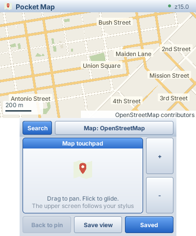
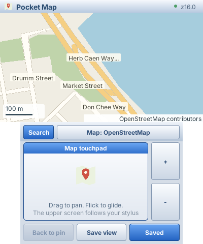
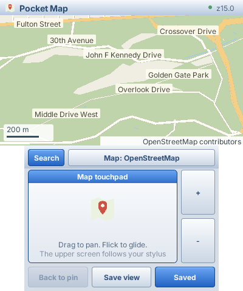
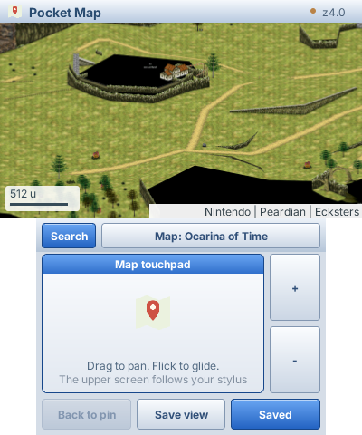
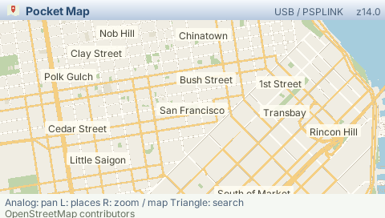

# Pocket Map

A map browser for Nintendo 3DS and PSP, built with [PocketJS](https://github.com/pocket-stack/pocketjs) and SolidJS 1.9. Browse **OSM vector maps**, Hyrule from **Breath of the Wild**, or the region and dungeon atlas from **Ocarina of Time**. Pan with the resistive touchpad, zoom, search and save places on the paired Mac.

The Mac fetches OSM vector tiles, prepares bounded geometry and streams it to the 3DS GPU drawing path. Four real San Francisco tiles used **79.5% fewer terrain bytes** than the previous raw bitmap path; z14 geometry is reused through display z18. Hyrule retains its complete local raster atlas and 2,576 searchable places, with no internet requests while browsing. See [vector architecture, measurements and limits](docs/VECTOR_MAP.md).

### San Francisco on the 3DS native renderer

Union Square, the Embarcadero near the Ferry Building, and Golden Gate Park:





These are **native 3DS screenshots captured in Azahar**, using real OSM data and
the production app's UI. The 400×240 upper and 320×240 lower framebuffers are
stacked without scaling. They are emulator captures, not console photographs.
[Capture method, coordinates and provenance](docs/images/CAPTURES.md).

OSM map data © [OpenStreetMap contributors](https://www.openstreetmap.org/copyright), served as Shortbread vectors by VersaTiles.

Map artwork belongs to Nintendo; the pinned atlas and marker source is [Zelda Dungeon's map repository](https://github.com/zeldadungeon/maps/tree/d32a85656031d861cef38e32eb927a7d08a983a9/public/botw). Downloaded assets and generated databases stay outside Git.

### Ocarina of Time

The third source uses [Ecksters' OoT Interactive Map](https://github.com/Ecksters/OoT-Interactive-Map/tree/020dab1b787bc18d1990653817765a1024bad43d), with Nintendo map artwork assembled by Peardian. It includes **456 searchable regions and rooms** and a complete **21,845-tile pyramid at levels 0–7**. Both Zelda maps can use prepared SD textures and retain independent camera positions and Mac bookmarks. [Prepare and install Ocarina of Time](docs/OCARINA.md).



This native Azahar capture reads the installed OoT pack through the 3DS SD
worker with **no paired Mac**. [Capture provenance](docs/images/CAPTURES.md#ocarina-of-time-2026-09-08).

## PSP over USB

The PSP port renders the same OSM vector geometry on its local GE, with a 480×272 single-screen UI, shoulder menus, a virtual keyboard and saved places on the Mac. The Mac performs network requests, vector preparation and image decoding through PocketJS's native USB offload worker. Hyrule retains its raster path. See [PSP setup, controls and measured limits](docs/PSP.md).



## Try it

Requirements: Bun 1.3.14, Docker with the PocketJS 3DS toolchain (or a supported native devkitPro install), Git, a Mac and a 3DS on the same LAN, Homebrew Launcher and ftpd. The runtime submodule pins the mesh and image resource support used by this app.

```sh
git clone --recurse-submodules https://github.com/pocket-stack/pocket-map.git
cd pocket-map
cd runtime && bun install --frozen-lockfile && cd ..
bun install --frozen-lockfile
bun run setup
bun run prepare:hyrule
bun run 3ds
# Open ftpd on the console first. Substitute its LAN IP.
bun run deploy 192.168.8.102
bun run host 192.168.8.102
```

Exit ftpd and open **Pocket Map** in HBL. The deployment script installs only this app and its pairing key, then reads both back for verification. Keys, saved places and the provider's cache stay under ignored `.local/`. `L + R + START` returns to HBL.

### Updating this build

**The current `POCKETJS_OFFLOAD` native build excludes the development server
and package storage path.** PocketJS's ordinary 3DS runtime supports guest
updates on port 8131, but that connection is unavailable in this build, even
with a valid development key. Rebuild with `bun run 3ds`, deploy through ftpd,
and restart Pocket Map for guest or native changes. Mac-only provider changes
need only a daemon restart. The offload UI path omits synchronous SD package
work; enabling safe development updates here needs native host integration.

For request timing and socket backpressure diagnostics, start the host with
`POCKET_MAP_TRACE=1 bun run host <3ds-ip>`. It records request IDs, method names,
provider duration, cumulative cache hits/downloads and socket drain waits.
Request payloads are omitted. A drain receipt measures the Mac socket's write
queue; it is not a device-render receipt.

| Control | Action |
| --- | --- |
| Bottom touchpad | Drag to pan; flick for inertia |
| Circle Pad / D-pad | Pan the upper map |
| `+` / `-` buttons | Animated zoom around the map center |
| Search / Y | Open the local keyboard; Find submits the query |
| Search results touchpad | Slide to choose a result, tap to open |
| D-pad up/down + A | Choose and open a search result or menu item |
| X / Back to pin | Return to the selected place |
| Hold L | Search, saved places, save map center, return to pin, or map home |
| Hold R | Zoom, label categories, switch map, clear pin, retry, or controls |
| Hold ZL + D-pad up/down | Open the vertical zoom rail; tap or hold to change levels |
| Map name on the lower screen | Switch OSM / Hyrule / Ocarina of Time without restarting |
| Save view / Save place | Name and save the center or selected search result on the Mac |
| Saved | Browse, rename, delete with confirmation, or return to a saved location |
| Saved page: Prev / Next or D-pad left/right | Turn five-place pages |
| B | Dismiss results/menu; backspace while typing |
| Shift | Tap for one uppercase letter; double-tap for caps lock |

The Mac keeps connection management separate from native decoding and network work. If the capability process exits, it is reaped and replaced on reconnect. Socket backpressure pauses traffic; cancelling a sent device request retains its wire credit until a reply or disconnection.

Typing, dragging, inertia and zoom transitions update locally. Missing tiles show a fallback; an already loaded previous zoom level stays visible during replacement. The optional [Hyrule SD pack](docs/SD_MAP.md) lets the 3DS open and load the entire terrain atlas without a Mac. Search, saved places, OSM and dynamic labels still use the paired host. Without the pack, a disconnected Mac leaves only resident tiles navigable.

## Hyrule on the 3DS SD card

After preparing the Mac atlas, run `bun run prepare:sd` and
`bun run deploy:sd <3ds-ip>` to install a **354 MiB** prepared texture pack.
The console reads and inflates individual records on a native worker; terrain
misses no longer require Wi-Fi. In one physical 3DS comparison, mean time to
ready terrain across four views fell from **1,178 ms over Wi-Fi to 293 ms from
SD**. This does not establish sustained 60 FPS. See [installation, storage costs,
measurements and limits](docs/SD_MAP.md).

## Complete local Hyrule atlas

`bun run prepare:hyrule` sparsely checks out a pinned Zelda Dungeon revision:
1,365 JPEG source tiles across six levels, about 49 MB. It rebakes the full
24,000px square source into **21,845 RGB565 textures across levels 0–7**, using
256px texture envelopes. Original source detail is preserved by subdividing
the 750px tiles; the top level is a 32,768px grid. In the desktop streaming path,
Deflate is used for Mac storage and the 3DS receives raw pixels. With the optional
SD pack, the Mac prepares PICA texture layout and the native SD worker inflates
individual records. The 3DS performs no JPEG decoding.

The completed `.local/hyrule/atlas.sqlite` is about **592 MB** and includes an
FTS5 index of regions, landmarks, towers, shrines, villages, Korok seeds and
treasures. Preparation publishes the database only after all levels complete.
It is reused on the next invocation; `--rebuild` explicitly replaces it.

The Hyrule provider has no HTTP fallback or request throttle. It reads the
prepared textures and keeps 128 decoded renditions on the Mac. The device
retains 40 tiles and requests up to 12 neighboring tiles with a 256px margin
and at most 512px of directional prediction. Repeated strokes accumulate camera
travel: lifting the stylus retains the direction for three seconds, followed by
expiry. Once direction is established, the extra tiles follow a forward corridor
instead of filling a surrounding ring. A turn changes the prediction.

After zooming in, a five-second prediction window prepares up to six tiles from
the next level around the center. These share the 12-extra-tile budget with pan
prediction and the same 40-entry cache. Visible tiles retain priority.
The finite world clamps at its edges; Map home returns to the Great Plateau.
Try searching `Kakariko`, `Hyrule Castle`, `Shrine` or `Great Plateau`.

## Switching maps and game labels

Tap the **Map** name on the lower screen, or use **R → Switch map**. Choose with
touch or D-pad / A. Each map remembers its last camera position, zoom and pin
for this guest session. The daemon keeps both providers available; all tile,
search and bookmark requests carry the selected source identity. Switching
clears old view demand and fences late responses. A pending bookmark mutation
must finish or be resolved before switching databases.

Hyrule's separate marker index contains 2,576 annotations. **R → Map labels**
selects all labels, places/shrines/towers, collectibles, enemies, or hides labels.
Regions appear at wide zooms; detailed items such as Koroks and treasures appear
from level 6. The Mac performs spatial queries and density selection. The guest
receives bounded point/name/category records and draws small baked icons plus
text locally, so labels move with the map without another network round trip.
OSM labels are independent of terrain geometry. Its menu offers Show / Hide labels; ASCII uses the shared local glyph atlas, with a cached image fallback for other scripts.

`prepare:hyrule` refreshes the separate marker index without rebaking existing
terrain textures. Marker assets and SQLite stay outside Git; the small UI icons
are drawn for this app.

## Saved places

Use **Save view** to store the map center, or **Save place** on a search result.
The local keyboard names it before Save sends a command to the Mac. Saved opens
five-place pages, with Rename, Delete and Go to place actions. Deletion uses an
animated confirmation sheet; B / Keep place cancels it.

The Mac stores Hyrule bookmarks in `.local/hyrule/places.sqlite`. The OSM provider
uses `.local/places.sqlite`, separate from `.local/cache.sqlite`. Geographic
bookmarks migrate without losing existing entries or operation receipts. Coordinates, zoom and names survive daemon restarts.
Mutations commit with an operation receipt: Retry after a missing acknowledgement
uses the same operation, so it cannot create a second copy or resurrect a deleted
place. Cancel after an unconfirmed command does not undo a Mac write; reopen
Saved to check its outcome. A connected Mac is needed for writes. The guest
retains up to four previously viewed pages during a disconnection.

## OpenStreetMap vector provider

Start `bun run host <3ds-ip> --osm` to open OSM first. Hyrule remains available
from the source picker when its atlas is installed. For an OSM-only setup, skip
`prepare:hyrule` and use `--osm`.

The default uses [VersaTiles' public Shortbread MVTs](https://docs.versatiles.org/guides/use_tiles_versatiles_org.html)
and [Photon place search](https://github.com/komoot/photon#demo-server), without
API keys. The Mac caches responses in SQLite, preserves HTTP validators and
prepares geometry in its isolated capability process. Search requires an
explicit submit and has a 1.1-second minimum interval.

Override the Shortbread endpoint in ignored `.local/provider.json`, then restart
the daemon. [VECTOR_MAP.md](docs/VECTOR_MAP.md#provider-configuration) includes an
OSM official endpoint example, protocol details, provider requirements and
measurement limits. Source z14 geometry remains resident while zooming through
z18; street-label windows query the same prepared source data.

Custom 256px PNG endpoints remain supported with `"format": "raster"`. Hyrule's
complete local JPEG-derived atlas stays on the R5G6B5 image path.

## Architecture and resource pattern

The app defines separate image and geometry collections. Both use the same
scheduler, view-demand merging, retry, fallback and eviction lifecycle:

```ts
const tiles = createOffloadMeshCollection(runtime, io, {
  key: (tile: TileInput) => `${tile.source}/${tile.z}/${tile.x}/${tile.y}`,
  method: "map.mesh", payload: JSON.stringify,
  maxEntries: 40, maxViews: 2, maxDemandsPerView: 24,
});
const view = createResourceView(tiles, { demand: visibleTileDemand });
// <ResourceMesh state={() => view.state(tile)} fallback={() => <TileSkeleton />} />
```

Hyrule declares `createPackedImageCollection` with a desktop fallback and renders `ResourceImage`.
Rendering starts no IO. The native worker owns reception; the scheduler admits
one materialization per frame; the collection returns staging and eventually
frees its native handles.

Map-specific policy remains in [app/model.ts](app/model.ts), [app/prediction.ts](app/prediction.ts)
and [app/annotations.ts](app/annotations.ts). [host/vector-geometry.ts](host/vector-geometry.ts)
prepares OSM geometry; [host/atlas.ts](host/atlas.ts) reads Hyrule textures.
[ARCHITECTURE.md](docs/ARCHITECTURE.md) records budgets and lifecycle.

## Validation

```sh
bun run check
runtime/node_modules/.bin/tsc --noEmit
bun run sim              # compiled guest, synthetic OSM provider, interaction replay
bun run sim --hyrule     # complete local atlas, search and delayed-response navigation
bun scripts/vector-sim.ts
bun scripts/vector-sim.ts --live  # a small real vector viewport, cached on Mac
qjs --std --stack-size 131072 scripts/quickjs-smoke.js
qjs --std --stack-size 131072 scripts/quickjs-smoke.js runtime/dist/3ds/guest/pocketmap-main.js hyrule
```

Generated captures and receipts go to `dist/qa/`. Replay covers keyboard input, selecting places, drag/inertia, zoom, sustained movement while replies wait, reconnect, date-line navigation and bounded resource ownership. Replay also covers saving, a lost acknowledgement and safe retry, renaming, paging, delete confirmation and entering a prefetched tile. Stress tests use synthetic tiles, not automated public-service downloads.

Native build, native transport, visual replay and physical interaction are separate checks. **No measured 60 fps claim is made yet.** Per-frame IO and image limits prevent network waits on the UI thread; JS, allocation, GPU uploads and presentation still need hardware measurement. See [docs/VALIDATION.md](docs/VALIDATION.md).
