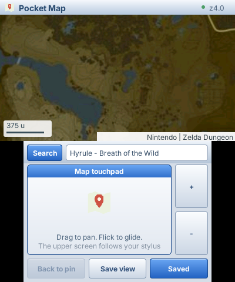
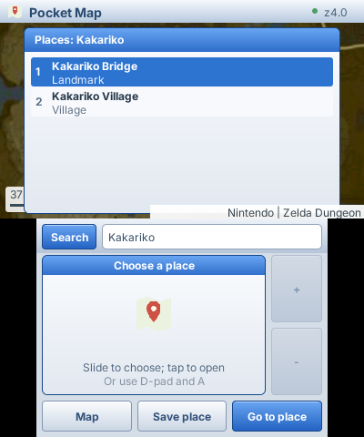

# Pocket Map

A map browser for Nintendo 3DS, built with [PocketJS](https://github.com/pocket-stack/pocketjs) and SolidJS 1.9. Explore the complete Hyrule map from **The Legend of Zelda: Breath of the Wild**, search 2,576 places, pan with the resistive touchpad, zoom and save locations. The paired Mac stores the complete atlas and search index. Browsing requires the LAN connection but makes **no internet requests**. An optional OpenStreetMap / Photon provider remains available.

<p> </p>

These are **compiled guest + Wasm captures**, at the 3DS's 400×240 / 320×240 logical resolutions, not console photographs. Map artwork belongs to Nintendo; the pinned atlas and marker source is [Zelda Dungeon's map repository](https://github.com/zeldadungeon/maps/tree/d32a85656031d861cef38e32eb927a7d08a983a9/public/botw). Downloaded assets and generated databases stay outside Git.

## Try it

Requirements: Bun 1.3.14, Docker with the PocketJS 3DS toolchain (or a supported native devkitPro install), Git, a Mac and a 3DS on the same LAN, Homebrew Launcher and ftpd. The runtime submodule pins the image-resource support used by this app.

```sh
git clone --recurse-submodules https://github.com/pocket-stack/pocket-map.git
cd pocket-map
cd runtime && bun install --frozen-lockfile && cd ..
bun run setup
bun run prepare:hyrule
bun run 3ds
# Open ftpd on the console first. Substitute its LAN IP.
bun run deploy 192.168.8.102
bun run host 192.168.8.102
```

Exit ftpd and open **Pocket Map** in HBL. The deployment script installs only this app and its pairing key, then reads both back for verification. Keys, saved places and the provider's cache stay under ignored `.local/`. `L + R + START` returns to HBL.

### Updating this build

**The current `POCKETJS_OFFLOAD` native build excludes the development server
and package storage path.** PocketJS's ordinary 3DS runtime supports guest
updates on port 8131, but that connection is unavailable in this build, even
with a valid development key. Rebuild with `bun run 3ds`, deploy through ftpd,
and restart Pocket Map for guest or native changes. Mac-only provider changes
need only a daemon restart. The offload UI path omits synchronous SD package
work; enabling safe development updates here needs native host integration.

For request timing and socket backpressure diagnostics, start the host with
`POCKET_MAP_TRACE=1 bun run host <3ds-ip>`. It records request IDs, method names,
provider duration, cumulative cache hits/downloads and socket drain waits.
Request payloads are omitted. A drain receipt measures the Mac socket's write
queue; it is not a device-render receipt.

| Control | Action |
| --- | --- |
| Bottom touchpad | Drag to pan; flick for inertia |
| Circle Pad / D-pad | Pan the upper map |
| `+` / `-` buttons | Animated zoom around the map center |
| Search / Y | Open the local keyboard; Find submits the query |
| Search results touchpad | Slide to choose a result, tap to open |
| D-pad up/down + A | Choose and open a search result or menu item |
| X / Back to pin | Return to the selected place |
| Hold L | Search, saved places, save map center, return to pin, or map home |
| Hold R | Zoom, clear pin, retry tiles, or show controls |
| Save view / Save place | Name and save the center or selected search result on the Mac |
| Saved | Browse, rename, delete with confirmation, or return to a saved location |
| Saved page: Prev / Next or D-pad left/right | Turn five-place pages |
| B | Dismiss results/menu; backspace while typing |
| Shift | Tap for one uppercase letter; double-tap for caps lock |

The Mac keeps connection management separate from native decoding and network work. If the capability process exits, it is reaped and replaced on reconnect. Socket backpressure pauses traffic; cancelling a sent device request retains its wire credit until a reply or disconnection.

Typing, dragging, inertia and zoom transitions update locally. Missing tiles show a fallback; an already loaded previous zoom level stays visible during replacement. A disconnected Mac leaves resident tiles navigable. Search, new tiles and uncached labels require the Mac, including in Hyrule mode. Offline here means independent of internet map services, not independent of the paired Mac.

## Complete local Hyrule atlas

`bun run prepare:hyrule` sparsely checks out a pinned Zelda Dungeon revision:
1,365 JPEG source tiles across six levels, about 49 MB. It rebakes the full
24,000px square source into **21,845 RGB565 textures across levels 0–7**, using
256px texture envelopes. Original source detail is preserved by subdividing
the 750px tiles; the top level is a 32,768px grid. Deflate compression is used
only for Mac storage. The 3DS receives raw pixels and performs no JPEG or
Deflate decoding.

The completed `.local/hyrule/atlas.sqlite` is about **592 MB** and includes an
FTS5 index of regions, landmarks, towers, shrines, villages, Korok seeds and
treasures. Preparation publishes the database only after all levels complete.
It is reused on the next invocation; `--rebuild` explicitly replaces it.

The Hyrule provider has no HTTP fallback or request throttle. It reads the
prepared textures and keeps 128 decoded renditions on the Mac. The device
retains 40 tiles and requests up to 12 neighboring tiles with a 256px margin
and at most 384px of directional prediction. Visible tiles retain priority.
The finite world clamps at its edges; Map home returns to the Great Plateau.
Try searching `Kakariko`, `Hyrule Castle`, `Shrine` or `Great Plateau`.

## Saved places

Use **Save view** to store the map center, or **Save place** on a search result.
The local keyboard names it before Save sends a command to the Mac. Saved opens
five-place pages, with Rename, Delete and Go to place actions. Deletion uses an
animated confirmation sheet; B / Keep place cancels it.

The Mac stores Hyrule bookmarks in `.local/hyrule/places.sqlite`. The OSM provider
uses `.local/places.sqlite`, separate from `.local/cache.sqlite`. Geographic
bookmarks migrate without losing existing entries or operation receipts. Coordinates, zoom and names survive daemon restarts.
Mutations commit with an operation receipt: Retry after a missing acknowledgement
uses the same operation, so it cannot create a second copy or resurrect a deleted
place. Cancel after an unconfirmed command does not undo a Mac write; reopen
Saved to check its outcome. A connected Mac is needed for writes. The guest
retains up to four previously viewed pages during a disconnection.

## Optional OpenStreetMap provider

Start `bun run host <3ds-ip> --osm` to use the geographic provider. Its configuration uses `https://tile.openstreetmap.de/{z}/{x}/{y}.png` and `https://photon.komoot.io/api/`, both verified reachable from the development Mac. The main `tile.openstreetmap.org` endpoint failed to connect in that network. No API keys are required by the selected demo endpoints.

Override OSM settings in `.local/provider.json`, then restart the host with `--osm`:

```json
{
  "tileURL": "https://tile.openstreetmap.org/{z}/{x}/{y}.png",
  "searchURL": "https://photon.komoot.io/api/",
  "name": "OpenStreetMap",
  "attribution": "OpenStreetMap contributors",
  "maxZoom": 18
}
```

The tile endpoint must return 256px PNGs; the search endpoint must implement the Photon response shape. HTTPS and loopback HTTP development endpoints are supported. The device sends typed tile coordinates, not arbitrary URLs. Tile identities include a hash of the source URL and rendition version.

Public services have limited capacity: [OSM DE's terms](https://openstreetmap.de/germanstyle/#nutzungsbedingungen), [tile usage policy](https://operations.osmfoundation.org/policies/tiles/), and [Photon's demo policy](https://github.com/komoot/photon#demo-server) apply. **The current viewport has priority; at most four nearby tiles provide short-range look-ahead.** The margin is 128 screen pixels and movement prediction is capped at 128 pixels; there is no area downloader or multi-level pre-seeding. The OSM DE service documents per-IP throttling after an unspecified high-speed tile allowance; a slow response does not necessarily produce HTTP 429. Searches require an explicit submit and are limited to one per 1.1 seconds on this provider. The Mac honors HTTP cache headers and conditional requests, using seven days for tiles without freshness headers. Use an appropriate hosted or self-hosted service before scaling beyond this personal demo. Endpoint configuration allows that switch without rebuilding the 3DS app.

## Architecture and resource pattern

```text
3DS UI thread                 3DS network worker          Mac capability process
camera + controls             authenticated TCP           local atlas / optional HTTPS
visible tile demand      ->   bounded request queue   ->  SQLite textures + place index
ResourceImage fallback   <-   native image tickets    <-  binary R5G6B5 pixels
one image upload/frame        eight staging slots         bounded tile/label output
```

The app uses `createOffloadImageCollection` to declare the tile identity and rendition once. View owners declare demand; reads subscribe by key. The runtime merges demands, schedules requests, retries failed reads, uploads within the frame budget and frees textures on eviction. Cancelling a response before upload returns its native staging slot.

```ts
const tiles = createOffloadImageCollection(runtime, io, {
  key: (tile: TileInput) => `${tile.source}/${tile.z}/${tile.x}/${tile.y}`,
  method: "map.tile", payload: JSON.stringify,
  width: 256, height: 256, maxEntries: 40,
  maxViews: 2, maxDemandsPerView: 24,
});
const view = createResourceView(tiles, { demand: visibleTileDemand });
// <ResourceImage state={() => view.state(tile)} fallback={() => <TileSkeleton />} />
```

Map-specific behavior remains in [app/model.ts](app/model.ts) and [app/geo.ts](app/geo.ts): coordinate systems, visible priorities, selection and search. [host/atlas.ts](host/atlas.ts) reads the prepared Hyrule atlas; [host/provider.ts](host/provider.ts) and [host/cache.ts](host/cache.ts) implement the optional HTTP provider. [docs/ARCHITECTURE.md](docs/ARCHITECTURE.md) records budgets, lifecycle and tradeoffs.

## Validation

```sh
bun run check
runtime/node_modules/.bin/tsc --noEmit
bun run sim              # compiled guest, synthetic OSM provider, interaction replay
bun run sim --hyrule     # complete local atlas, search and delayed-response navigation
bun run sim --live       # current live viewport + one explicit place search
qjs --std --stack-size 131072 scripts/quickjs-smoke.js
qjs --std --stack-size 131072 scripts/quickjs-smoke.js runtime/dist/3ds/guest/pocketmap-main.js hyrule
```

Generated captures and receipts go to `dist/qa/`. Replay covers keyboard input, selecting places, drag/inertia, zoom, sustained movement while replies wait, reconnect, date-line navigation and bounded resource ownership. Replay also covers saving, a lost acknowledgement and safe retry, renaming, paging, delete confirmation and entering a prefetched tile. Stress tests use synthetic tiles, not automated public-service downloads.

Native build, native transport, visual replay and physical interaction are separate checks. **No measured 60 fps claim is made yet.** Per-frame IO and image limits prevent network waits on the UI thread; JS, allocation, GPU uploads and presentation still need hardware measurement. See [docs/VALIDATION.md](docs/VALIDATION.md).
