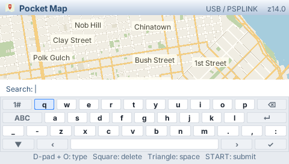
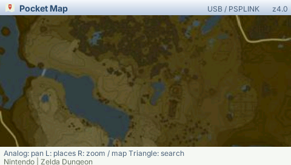

# Pocket Map on PSP

The PSP version uses **PSPLINK USB for capabilities and the local GE for rendering**. The Mac fetches and parses OSM vector tiles, simplifies and triangulates them into PMH1 meshes, and decodes Hyrule images. The PSP pans and zooms its cached map without requesting a new screen image from the Mac. Search, saved places, labels and cache ownership share the 3DS model and provider.

## Build and run

Use the pinned PocketJS runtime, Bun dependencies and PSP toolchain. Install `usbhostfs_pc` and `pspsh` and start PSPLINK on the USB-connected console.

```sh
bun run psp
# Keep these running in separate terminals. Only one usbhostfs process
# should own this PSP; its mounted root must match host:psp.
usbhostfs_pc -b 10000 dist/psplink
bun run host:psp
pspsh -e 'ldstart host0:/pocket-map.prx'
```

`dist/psp/EBOOT.PBP` is also generated, with the XMB title **Pocket Map**. To install it to a Memory Stick through an active PSPLINK session:

```sh
cp dist/psp/EBOOT.PBP dist/psplink/pocket-map.pbp
pspsh -e 'mkdir ms0:/PSP/GAME/PocketMap'
pspsh -e 'cp host0:/pocket-map.pbp ms0:/PSP/GAME/PocketMap/EBOOT.PBP'
pspsh -e 'cp ms0:/PSP/GAME/PocketMap/EBOOT.PBP host0:/pocket-map-readback.pbp'
cmp dist/psp/EBOOT.PBP dist/psplink/pocket-map-readback.pbp
```

Rebuilds require a module restart: `pspsh -e reset`, wait for the USB connection, then load the PRX again. **The EBOOT does not install or start the PSPLINK USB driver.** Uncached content requires a running PSPLINK host0 connection and Mac provider. Hardware runtime validation used the PRX under PSPLINK; Memory Stick installation was checked by file readback. Standalone XMB USB startup has not been implemented or validated. `ldstart` loads the PRX, not the packaged PBP.

Rest the analog nub at launch. The PSP host calibrates a stable center from 16 samples within a bounded startup window; full travel is rescaled around that center. Hold **SELECT with the nub at rest** to repeat calibration. The shared runtime then applies its normal deadzone. This addresses the test PSP's untouched raw reading of approximately `(162,133)` instead of `(128,128)`.

| Control | Action |
| --- | --- |
| Analog nub / D-pad | Pan locally |
| Hold L, D-pad, Circle | Search, saved places, save center, return to pin or home |
| Hold R, D-pad, Circle | Zoom, labels, source selection, retry or help |
| Triangle | Open the keyboard |
| Keyboard: D-pad + Circle | Choose and type a key |
| Keyboard: Square / Triangle | Backspace / space |
| Keyboard: R / L | Uppercase / symbols |
| START | Submit text; save the map center or a search result |
| Saved places: START / Square | Rename / delete with confirmation |
| Saved places: left/right | Turn pages |
| Cross | Close keyboard, return to map, or cancel deletion |
| SELECT at rest | Recalibrate the analog nub |

The keyboard uses the framework's modal input ownership, so its shoulder shortcuts cannot also open the map menus. Hyrule remains available through R → Switch map after `bun run prepare:hyrule` has downloaded the local atlas.

## Resource limits

The viewport is **480×272**. The PSP selects up to 24 terrain resources rather than the 3DS configuration's 40. Native transport has eight fixed staging slots; the shared resource runtime admits three concurrent reads and materializes one completion per frame. Retained GE vertex allocations, including retired buffers, have a 4 MiB limit. The Mac's SQLite HTTP cache and saved-place store remain under ignored `.local/` and can be reused by the LAN provider.

Four sampled San Francisco PMH1 meshes total 107,464 terrain bytes (26,866 bytes/tile on average), compared with 524,288 bytes for four raw RGB565 tiles. A horizontal, integer-zoom pan exposing 3.75 tiles/second would require approximately 0.10 MB/s of terrain payload for those samples. **This is a workload estimate, not a measured USB ceiling**; it excludes labels, envelope/file RPC overhead, other movement directions and denser tiles.

Pocket YouTube established the USB host0 transport route. Map tiles require independent request identities and reliable completion ownership, while video can discard superseded whole frames. PocketJS now places the blocking host0 RPCs on a lower-priority native worker; no file reads, image codecs or MVT parsing run inside the map's JavaScript frame callback. See the runtime's [PSP offload contract](../runtime/docs/PSP_OFFLOAD.md).

## Hardware evidence

The real PSP completed the scripted checkpoints: OSM map, keyboard typing/backspace, San Francisco search, continuous pan, zoom, save, saved-place list, confirmed deletion, Hyrule, and return to OSM. The test removes the bookmark it creates. Captures below are **real PSP framebuffers obtained through PSPLINK**, with the UI thread briefly suspended after a checkpoint so the framebuffer is complete. They are not physical-button acceptance receipts.

<p></p>
<p></p>
<p></p>

On the same settled SF view at 333 MHz, elapsed CPU-side frame work changed from approximately **33.5 ms → 18.1 ms → 14.3 ms** after skipping unchanged resource unions and repeated stationary-map calculations. Stable samples then advanced by 120 frames per approximately 2.00 seconds. Those settled frames fit 60 Hz; moving into new resources and mounting the keyboard/menu still produce longer frames. GE submission measured roughly 0.4–0.5 ms; submission duration alone is not GPU execution time.

The USB host process was suspended for more than five seconds while the app ran. The PSP UI thread's run counter continued advancing and its cached map survived; communication recovered when the process resumed. This exercises a blocked transport, not just a provider error response. Performance logs taken during debugger screenshots include debugger preemption and should not be used as an uncontaminated frame-time percentile benchmark.

To repeat the scripted hardware run, build with `bun run psp --smoke`, start `bun run test:psp:watch`, reset/load the PRX, and inspect `dist/qa/psp/smoke.json`. `--smoke` overrides controller input and disables automatic framebuffer dumps. Rebuild without that option and reload before handing the PSP back for manual use.
