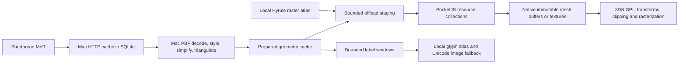

# OSM vector maps on 3DS

## Data and execution

**OSM now uses Shortbread vector tiles. Hyrule retains its complete raster atlas.**
The default endpoint is VersaTiles' public OSM service; the URL and source settings
live in the Mac provider configuration. The previous OSM route fetched PNGs and
sent a 256×256 R5G6B5 plane: 131,072 pixel bytes per tile. The new route fetches
MVT/PBF, prepares indexed geometry on the Mac and sends a bounded binary mesh.



The UI JavaScript thread updates the camera, resource demand and UI controls.
The 3DS native worker handles socket reception and validates binary envelopes.
The Mac capability process performs PBF decoding, geometry simplification,
polygon tessellation, HTTP, SQLite and Unicode text rendering. This follows the
worker/bucket separation in [Mapbox GL JS's architecture](https://github.com/mapbox/mapbox-gl-js/blob/main/ARCHITECTURE.md):
GPU drawing consumes prepared geometry; the GPU does not parse protobuf.

**No extra JavaScript thread or device-side PBF parser is required.** The current
3DS worker uses lower priority and libctru affinity `-2`, rather than assuming
all New 3DS cores are available to applications. Moving the Mac preparation
stage into another native device worker is a future host implementation choice;
it does not change the guest resource API.

## What carries over from Google Maps 5.0

Google's [December 2010 engineering article](https://googleblog.blogspot.com/2010/12/under-hood-of-google-maps-50-for.html)
describes geometry reuse across zoom and viewing angles, independently placed
labels, and offline caching. Its “100 times” comparison concerns viewing maps
across all zoom levels. It is not a promised ratio for one MVT or one prepared
mesh.

Pocket Map implements these relevant parts:

- Quantized coordinates and indexed triangles replace raster tile transmission.
- The device applies local pan/zoom transforms to resident geometry.
- **Source geometry at z14 is reused through display z18.** New high-zoom label
  windows query the already prepared source tile and place road names on the
  visible part of each line. They do not fetch another MVT.
- Lower source levels remain separate resources; a previous ready level stays
  behind incoming content while zooming.
- Same-level directional look-ahead retains travel direction across gestures.
  Public VersaTiles requests remain bounded to four extra tiles; the complete
  Hyrule atlas permits twelve, including the next zoom level after zoom-in.
- Geometry, label windows and Unicode fallbacks share the resource scheduler.

This is a 2D street map renderer. It does not implement Google/Mapbox's full
style engine, 3D buildings, routing, terrain, line-following rotated text or
arbitrary zoom-dependent style expressions. Prepared road widths scale with the
geometry. Dense tiles reduce minor detail to fit the device budget, so the
result is not visually identical to the previous server-rendered PNG.

## Text

**ASCII map labels use the existing shared baked glyph atlas.** Their positions
follow the map while their font size stays fixed. The guest chooses at most
12 visible labels, deduplicates names, avoids overlapping rectangles and keeps
already visible labels stable where possible.

Names outside the baked font repertoire use a separately cached 256×32 label
image with a skeleton fallback. The Mac explicitly selects a CJK font when
needed. This preserves readable multilingual names without baking labels into
every map tile. Dynamic Unicode glyph pages are not implemented in this change.

Mapbox's [text rendering design](https://github.com/mapbox/mapbox-gl-native/wiki/Text-Rendering)
uses a glyph atlas and signed distance fields. The current PICA200 backend uses
fixed fragment combiners; its programmable vertex shader does not provide the
fragment shader needed to copy Mapbox's SDF approach directly. Baked coverage
fonts are the applicable atlas path here.

## Bounds and ownership

| Stage | Bound |
| --- | --- |
| MVT response body | 2 MiB, in the Mac process |
| Considered source geometry | 200,000 points; 20,000 features per layer |
| Prepared entry | 4,096 vertices, 2,048 triangles, 36,880 bytes |
| Coordinates | Unsigned 1/16 logical pixels, inside the declared rectangle |
| Mac prepared cache | 128 source tiles, honoring HTTP expiry |
| Device geometry cache | 40 entries, two demand owners |
| Shared resource requests | 3 active, one start and one completion per frame |
| Shared native staging | Eight slots for images and meshes together |
| Materialization | One image or mesh per frame |
| Label windows | 40 cached; up to 12 demanded, at most 12 rows per reply |
| Visible labels | 12, with bounded overlap checks |
| Native mesh handles | 128 slots; generation-tagged, separate from textures |
| Retained 3DS mesh buffers | 8 MiB, including buffers awaiting GPU retirement |
| 3DS immediate vertex arena | 65,536 vertices shared by both screens |

The provider triangulates complete polygons, preserving holes, then clips the
result. Coarser detail passes simplify complete shapes and omit minor layers;
they do not transmit an arbitrary triangle prefix. Dense tiles remove small
parcels/holes, minor line layers and road casings. Coarse road preparation joins
degree-two endpoints and deduplicates links on a tile-aligned grid; junctions
remain endpoints. Shape simplification tolerance stops at two logical pixels,
while feature selection can continue to reduce detail. A final admission pass
selects complete geographic areas and long major roads within the existing
vertex/triangle limits, then restores painter order. It can omit smaller roads
or decorative features instead of failing an otherwise valid tile.

Invalid indices, coordinates,
versions or byte counts are rejected before acquiring native mesh residency.

`createOffloadMeshCollection` owns materialization and eviction. `ResourceMesh`
borrows the handle and declares its fallback. Cancelled sent work retains its
wire credit until a response or disconnect; late responses release staging.
Meshes and images have the same lifecycle but separate native handle tables.

**3DS mesh materialization uploads an immutable GPU vertex buffer once.**
Opaque mesh Views emit ten words per visible tile: its generation-tagged handle,
affine transform and clip rectangle. PICA transforms and clips the resident
vertices. Camera motion does not expand triangles into the immediate vertex
arena. Uploads share the one-per-frame image/mesh completion budget and fail
through the resource retry path if the buffer cannot be allocated.

Replacing or evicting a resource cannot free memory still referenced by the
previous GPU frame. The backend retires these buffers after `C3D_FrameBegin`
confirms that frame has completed. Wasm and other existing backends retain the
CPU-clipped TRI path; 3DS also uses it for translucent mesh Views. The limits
bound work; device timing remains a separate validation gate.

## Provider configuration

The default [VersaTiles service](https://docs.versatiles.org/guides/use_tiles_versatiles_org.html)
uses `https://tiles.versatiles.org/tiles/osm/{z}/{x}/{y}`. Set a different
Shortbread endpoint in ignored `.local/provider.json` without rebuilding the
3DS application:

```json
{
  "format": "vector",
  "tileURL": "https://vector.openstreetmap.org/shortbread_v1/{z}/{x}/{y}.mvt",
  "dataZoom": 14,
  "maxZoom": 18,
  "name": "OpenStreetMap"
}
```

Restart the daemon after changing its configuration. Source identity includes
the endpoint and prepared style revision, preventing old resources from being
mixed with a new source. HTTP requests identify Pocket Map, preserve validators
and honor cache expiry. When using `vector.openstreetmap.org`, predictive HTTP
downloads are disabled to follow its [vector tile policy](https://operations.osmfoundation.org/policies/vector/).
For regional offline use, obtain a licensed regional tile archive through a
provider's supported download workflow; do not scrape the public endpoint.

## Measurements and reproduction

A compiled guest + Wasm replay viewed four real San Francisco tiles at z14,
then zoomed through z18 and returned. The MVTs and receipts stay under ignored
`.local/` and `dist/qa/`; screenshots in `docs/images/` are curated captures.

| Quantity | Measured |
| --- | --- |
| Four prepared mesh records, including wire headers | 107,464 bytes |
| Four equivalent old raw raster records | 524,368 bytes |
| Terrain byte reduction | 79.5% |
| Additional terrain transfers for z15–18 | 0 |

Label-window JSON and occasional Unicode images are additional traffic. See
`dist/qa/vector-live.json` for these totals. Synthetic replay figures are not
used as a real-world compression ratio. Wasm software raster times do not
measure PICA200 performance or real 3DS frame rate.

```sh
bun run check
bun run 3ds
bun scripts/vector-sim.ts            # generated MVTs, delayed replies, disconnects
bun scripts/vector-sim.ts --live     # a small real viewport, persistent HTTP cache
bun scripts/sim.ts --hyrule          # complete real local atlas regression
qjs --std --stack-size 131072 scripts/quickjs-smoke.js runtime/dist/3ds/guest/pocketmap-main.js
```

Framework validation covers native socket transfer in both thread and process
provider modes, maximum-size geometry, malformed/truncated data, stale handles,
shared staging credit, cancellation, failed uploads, polygon clipping and
resource cleanup. Pocket Map tests cover polygon holes, dense-tile detail
reduction, source routing, label/geometry deduplication and source/display LOD.
